# Solution
Using Depth First Search to explore the connected component.

Run:
```
mkdir build && cmake ..
make -j 4
./blobDetection
```

Visualize result:
```
python3 visualize.py
```

Note:
1. Copy the data to data/data.bin.
2. The blobDetection result is in data/results.txt.
3. The visualize data is in data/visualize.

Output (test on Dell Inspiron 15 7000, i7 8th, MX250):
```
Elapsed time in milliseconds [Test] : 50 ms

(11, 365, 81, 71) (38, 248, 86, 100) (79, 23, 60, 74) (104, 451, 94, 153) 
(0, 125, 61, 96) (30, 401, 90, 91) (218, 33, 70, 85) (263, 0, 59, 30) (403, 477, 51, 51) (419, 457, 38, 21) 
(46, 229, 47, 47) (95, 274, 19, 37) (254, 569, 59, 71) (352, 360, 98, 98) (384, 548, 91, 78) 
(173, 223, 74, 77) (220, 0, 87, 78) (298, 166, 91, 93) (401, 565, 39, 55) (421, 516, 89, 89) 
(26, 115, 77, 85) (128, 207, 85, 102) (208, 82, 74, 68) (386, 541, 80, 78) (419, 457, 87, 67) 
(0, 575, 47, 69) (167, 343, 73, 73) (223, 400, 59, 67) (343, 63, 88, 87) (375, 508, 65, 75) 
(104, 0, 94, 72) (153, 220, 83, 90) (310, 102, 87, 110) (420, 177, 80, 81) 
(0, 462, 79, 75) (228, 348, 125, 112) (302, 0, 48, 48) (346, 0, 29, 40) (418, 0, 90, 42) 
(0, 584, 80, 86) (159, 21, 83, 119) (317, 585, 95, 96) (372, 361, 86, 87) 
(248, 90, 78, 88) (302, 190, 76, 87) (373, 86, 92, 79) (383, 220, 89, 79) (426, 0, 85, 82) 
```

Visualize Result:
| | | |
|:-------------------------:|:-------------------------:|:-------------------------:|
|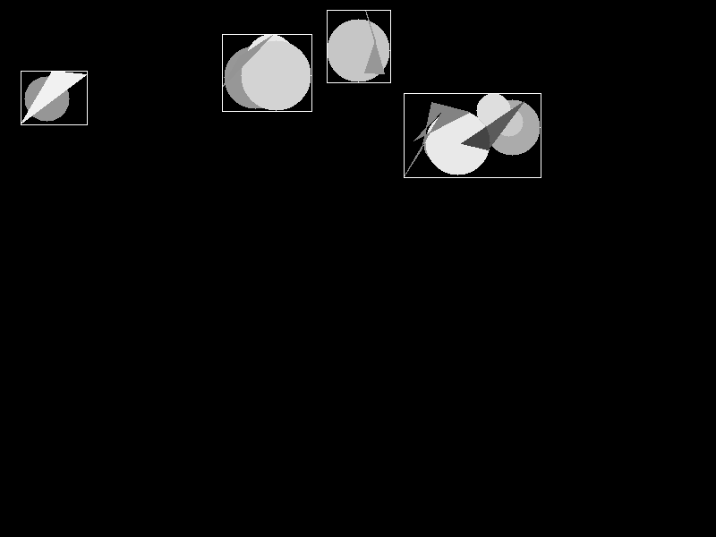  0.png |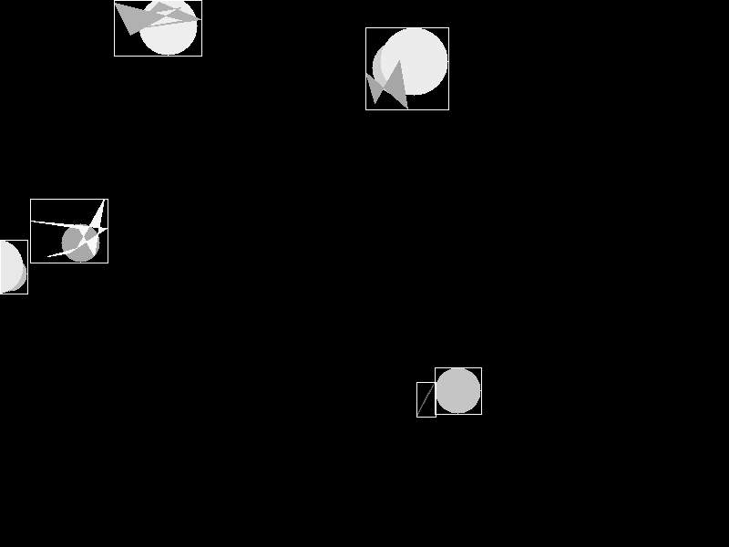  1.png |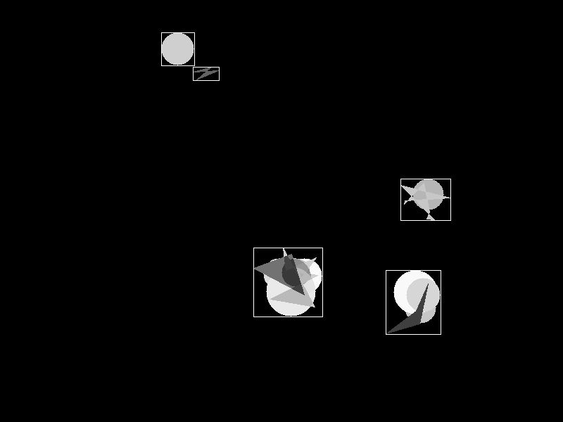  2.png |
|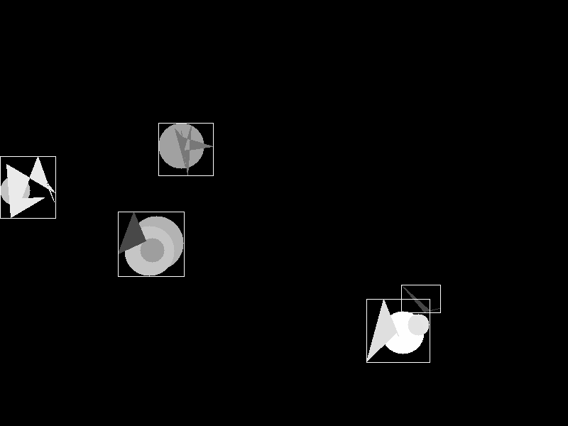  3.png |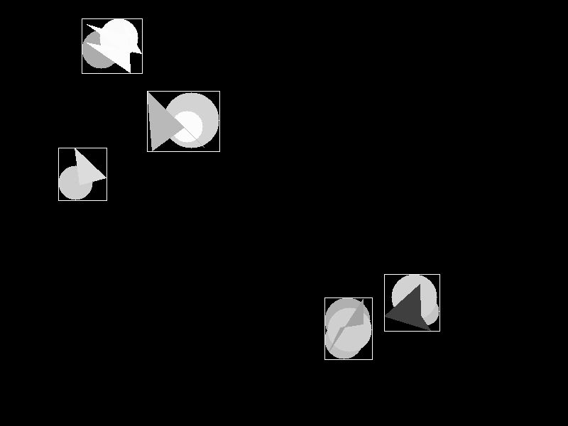  4.png |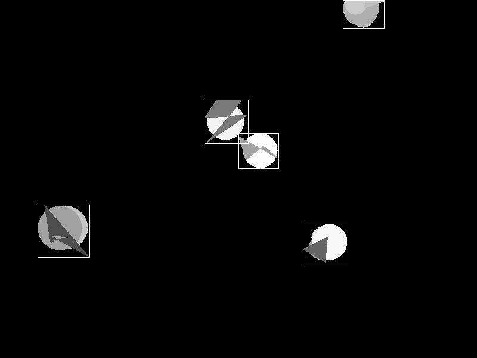  5.png |
|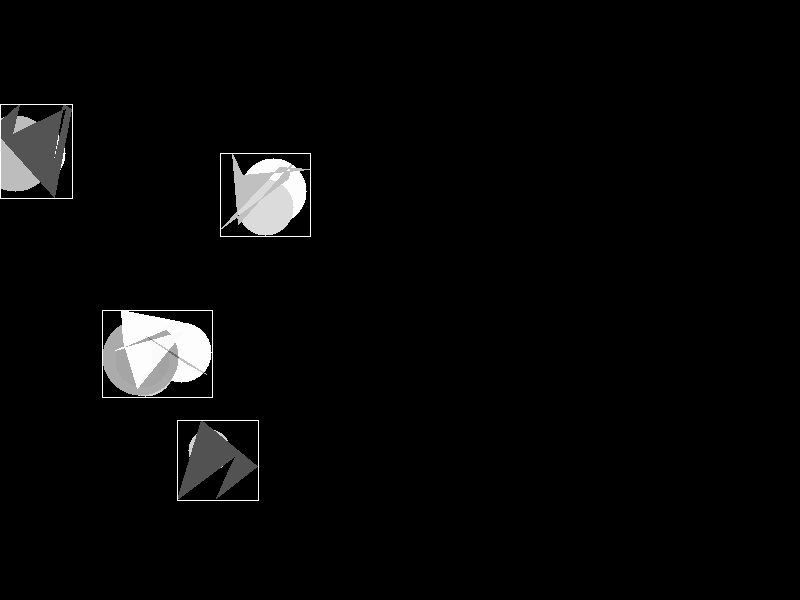  6.png |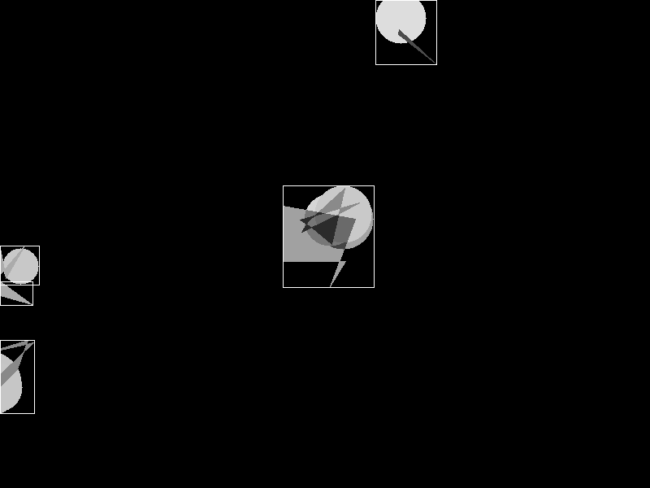  7.png |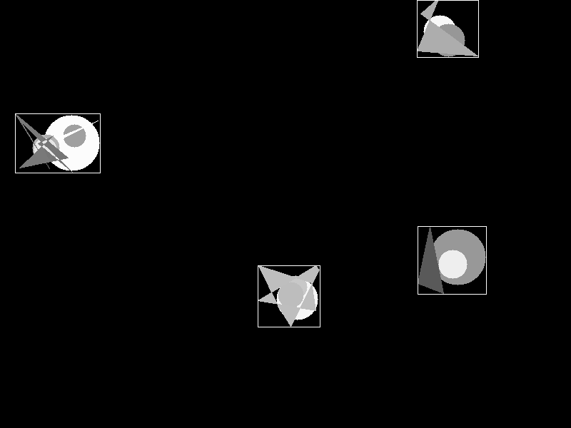  8.png | |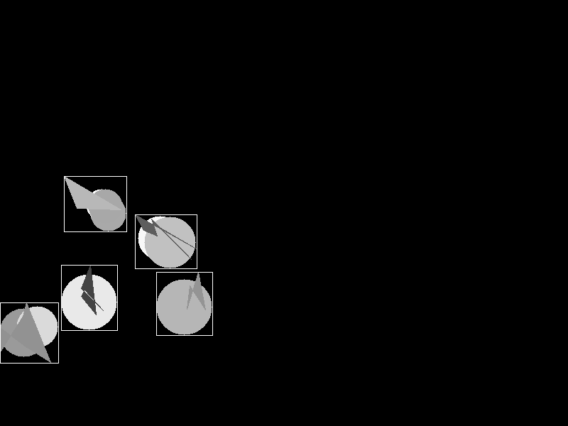  9.png |

# Zeta Motion LTD  - Technical Challenge for Software Engineer (CPP001)

In this challenge, you will be asked to write a simple application in C/C++ to find the bounding boxes of the objects in an
image, as shown in Figure 1. An object is defined as a continuous "Blob" of non-black pixels.

| Figure 1.  Detected Objects       |
| ------------- |
|  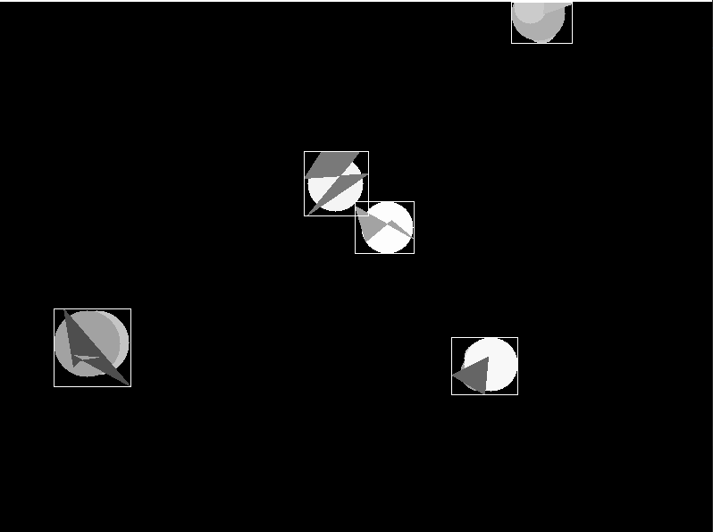 |

Your task is to

1. Use `main.cpp` as a starting point to load `data.bin` file into memory
2. Read in `data.bin`, which contains an array of `unsigned char` numbers (0 - 255), which holds image frames with shape (10, 600, 800). Each image is stored in row-major format.
3. Implement an algorithm that identifies the bounding boxes of the objects in each image frame. 
All bounding boxes should be exported in format (top, left, height, width) to a txt file; One line for each image frame.

The success criteria for your programme are:

1. Accurate number of bounding boxes
2. Accurate positions and sizes
3. High performance (please use the macro provided to measure running time)
4. Bug free

Please note:

1. Don't use any third party library to implement the algorithm (you can do better than them). However, you can use any tool to visualise the images for debugging purposes.
2. Make comments wherever relevant
